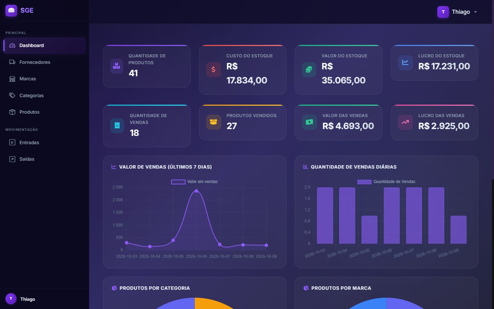
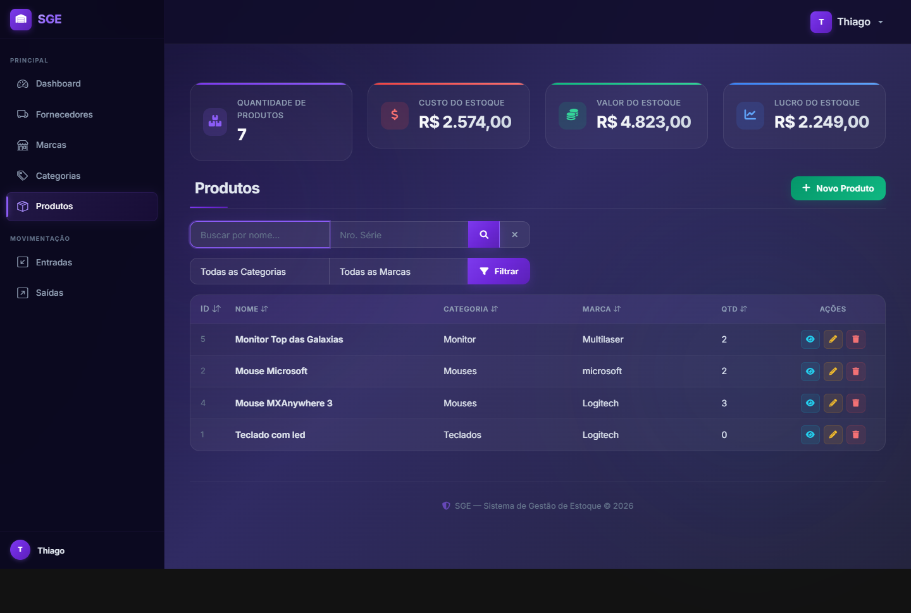
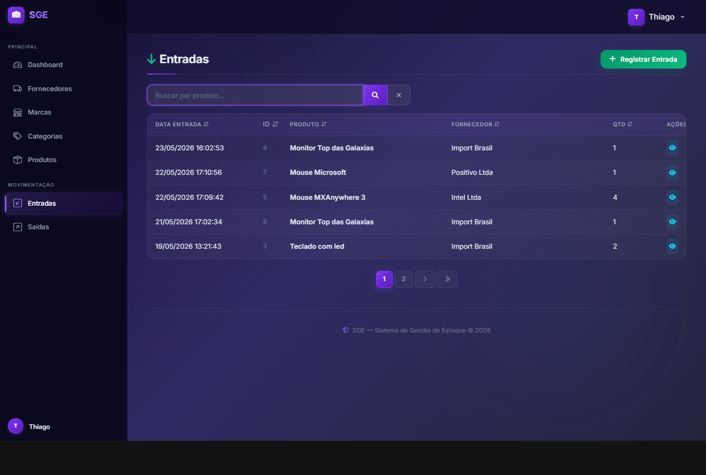
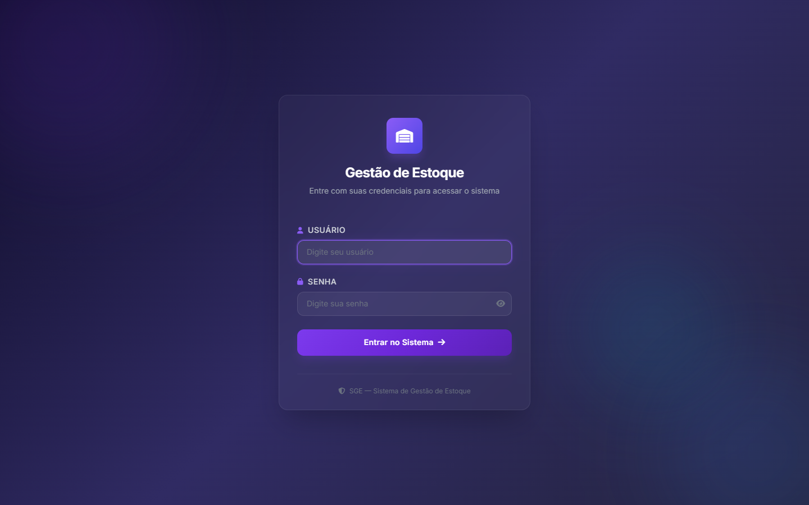

# Sistema de Gestão de Estoque (SGE)


Sistema de gestão de estoque desenvolvido com Django e Django REST Framework. Controla produtos, marcas, categorias e fornecedores, além de entradas e saídas de estoque com atualização automática das quantidades. Oferece interface web (templates) e API REST autenticada por JWT.



*Dashboard — indicadores de estoque, vendas e gráficos.*

## Sumário

- [Visão geral](#visão-geral)
- [Telas do projeto](#telas-do-projeto)
- [Funcionalidades](#funcionalidades)
- [Tecnologias](#tecnologias)
- [Estrutura do projeto](#estrutura-do-projeto)
- [Instalação e execução](#instalação-e-execução)
- [Variáveis de ambiente](#variáveis-de-ambiente)
- [Banco de dados](#banco-de-dados)
- [Executar com Docker](#executar-com-docker)
- [API REST](#api-rest)
- [Testes](#testes)
- [Principais rotas](#principais-rotas)
- [Painel administrativo](#painel-administrativo)
- [Licença](#licença)

## Visão geral

O **SGE** é um sistema web e de API para gerenciamento de estoque. Usuários autenticados e com permissão podem cadastrar, listar, alterar e remover marcas, categorias, fornecedores e produtos. Cada movimento de **entrada** soma e cada **saída** subtrai automaticamente a quantidade do produto em estoque, via *signals* do Django. A tela inicial apresenta indicadores e gráficos de produtos e vendas.

## Telas do projeto

**Produtos** — listagem com busca, filtros por categoria e marca, ordenação e ações:



**Entradas de estoque** — movimentações de entrada com atualização automática da quantidade:



**Login** — acesso ao sistema:



## Funcionalidades

- CRUD de produtos, marcas, categorias e fornecedores
- Entradas e saídas de estoque com atualização automática da quantidade
- Dashboard com métricas de estoque, vendas e gráficos
- Cadastro e edição de perfil de usuário (com avatar)
- Autenticação de usuários e controle de permissões por ação
- API REST autenticada por JWT (tokens de acesso e atualização)
- Busca, filtro e ordenação nas listagens
- Painel administrativo do Django

## Tecnologias

- Python
- Django 5.0
- Django REST Framework + SimpleJWT
- drf-spectacular (documentação da API)
- python-decouple (variáveis de ambiente)
- SQLite e PostgreSQL (via psycopg2)
- Bootstrap 5
- Docker e Docker Compose
- flake8 (desenvolvimento)
- GitHub Actions (CI)

## Estrutura do projeto

```
sge/
├── app/                # configurações, urls raiz, home e templates base
├── core/               # BaseModel, middleware, permissões e template tags
├── authentication/     # perfil de usuário e autenticação JWT
├── brands/             # CRUD de marcas (HTML + API)
├── category/           # CRUD de categorias (HTML + API)
├── supplier/           # CRUD de fornecedores (HTML + API)
├── product/            # CRUD de produtos (HTML + API)
├── inflow/             # entradas de estoque (HTML + API)
├── outflow/            # saídas de estoque (HTML + API)
├── static/             # arquivos estáticos de origem
├── .github/workflows/  # pipeline de CI (GitHub Actions)
├── Dockerfile
├── docker-compose.yml
├── .env.example        # exemplo de variáveis de ambiente
├── manage.py
├── requirements.txt
└── requirements_dev.txt
```

## Instalação e execução

Pré-requisitos:

- Python 3.11 ou superior instalado

Crie um ambiente virtual:

    python -m venv .venv

No Windows, ative o ambiente virtual:

    .venv\Scripts\activate

No Linux ou macOS, ative o ambiente virtual:

    source .venv/bin/activate

Instale as dependências:

    pip install -r requirements.txt

Opcionalmente, para desenvolvimento (lint), instale também:

    pip install -r requirements_dev.txt

Crie o arquivo de ambiente (veja [Variáveis de ambiente](#variáveis-de-ambiente)):

    copy .env.example .env        # Windows
    cp .env.example .env          # Linux/macOS

Aplique as migrações:

    python manage.py migrate

Crie um usuário administrador:

    python manage.py createsuperuser

Inicie o servidor:

    python manage.py runserver

A aplicação estará disponível em:

    http://127.0.0.1:8000/

## Variáveis de ambiente

Copie o `.env.example` para `.env` e ajuste os valores:

    # Django
    SECRET_KEY=troque-por-uma-chave-secreta
    DEBUG=True
    ALLOWED_HOSTS=0.0.0.0,127.0.0.1,localhost

    # Cookies
    SESSION_COOKIE_NAME=sge_sessionid
    CSRF_COOKIE_NAME=sge_csrf

    # Superusuário (usado com createsuperuser --noinput)
    DJANGO_SUPERUSER_USERNAME=
    DJANGO_SUPERUSER_EMAIL=
    DJANGO_SUPERUSER_PASSWORD=

    # Banco de dados (veja a seção "Banco de dados")
    DB_ENV=dev
    ACTIVE_DB=sqlite
    POSTGRES_DB=sge
    POSTGRES_USER=postgres
    POSTGRES_PASSWORD=
    POSTGRES_HOST=localhost
    POSTGRES_PORT=5432

## Banco de dados

O projeto pode rodar com dois bancos, controlados pelas variáveis `DB_ENV` e `ACTIVE_DB`:

- `DB_ENV=dev` + `ACTIVE_DB=sqlite` → SQLite (`db.sqlite3`)
- `DB_ENV=dev` + `ACTIVE_DB=postgresql` → PostgreSQL
- `DB_ENV=prd` → força PostgreSQL (usado no Docker)

## Executar com Docker

A forma recomendada de rodar o sistema. O Docker Compose sobe a aplicação **e** o PostgreSQL já configurados, sem precisar montar o ambiente Python manualmente.

**Pré-requisitos:**

- Docker Desktop instalado e em execução (engine)
- Docker Compose (já vem com o Docker Desktop)
- Git instalado (para clonar o repositório)
- A porta `8000` livre

> **Importante:** o Docker Desktop sozinho **não** faz o setup inicial — ele é o *engine* e o painel de gerenciamento. Criar o `.env` e rodar `docker compose up --build` são feitos pelo **terminal**; o Docker Desktop é ótimo para acompanhar logs, iniciar/parar e abrir um terminal dentro do container **depois** que a stack subiu.

> **Atenção:** neste projeto o `docker-compose.yml` usa `env_file: .env`, então o arquivo `.env` é **obrigatório** — sem ele o `docker compose up` falha. Crie-o no passo 2.

### Passo a passo (via shell / PowerShell)

**1. Clone o repositório**

```powershell
git clone https://github.com/ThiagoHMDornelas/sge.git
cd sge
```

> O `git clone` cria a pasta `sge` dentro da pasta atual, e o `cd` entra nela. Se você **já está dentro** da pasta do projeto, **pule o `cd`**.

**2. Crie o arquivo de ambiente**

```powershell
copy .env.example .env        # Windows
# cp .env.example .env        # Linux/macOS
```

> Atenção: se você **já tem** um `.env` na pasta, o comando acima vai **sobrescrevê-lo**. Nesse caso, **pule este passo** e apenas edite o `.env` existente.

As variáveis `POSTGRES_*` têm valores padrão no Compose, mas o `.env` é necessário para o `SECRET_KEY` e demais configurações. Veja a seção [Variáveis de ambiente](#variáveis-de-ambiente).

**3. Suba a stack.** Na primeira execução o Docker baixa a imagem do PostgreSQL e compila a imagem da aplicação — pode levar alguns minutos:

```powershell
docker compose up --build -d
```

**4. Confira os containers:**

```powershell
docker compose ps
```

Espere o `sge_db` como `healthy` e o `sge_web` como `Up`. O `sge_web` só inicia depois que o banco fica saudável (via `healthcheck`), então não há erros de conexão na inicialização. As migrações são aplicadas automaticamente.

| Serviço | Porta | Acesso |
|---|---|---|
| `sge_web` | 8000 | `http://localhost:8000` |
| `sge_db` | 5432 (interna) | — |

**5. Acesse:**

- Aplicação: `http://localhost:8000/`
- Login: `http://localhost:8000/login/`
- Documentação da API (Swagger): `http://localhost:8000/api/docs/`

**6. Crie o superusuário.** Antes, preencha `DJANGO_SUPERUSER_USERNAME`, `DJANGO_SUPERUSER_EMAIL` e `DJANGO_SUPERUSER_PASSWORD` no `.env` — com esses campos vazios (como no `.env.example`), o `--noinput` falha com o erro *"Usuário cannot be blank"*:

```powershell
docker compose exec sge_web python manage.py createsuperuser --noinput
```

> Para digitar usuário e senha manualmente, remova o `--noinput`.

**7. (Opcional) Obtenha um token JWT pela API:**

```powershell
curl -X POST http://localhost:8000/api/v1/authentication/token/ -H "Content-Type: application/json" -d "{\"username\":\"seu_usuario\",\"password\":\"sua_senha\"}"
```

**8. Comandos úteis:**

```powershell
docker compose logs -f sge_web     # logs da aplicação
docker compose logs -f sge_db      # logs do banco
docker compose restart sge_web     # reinicia a aplicação
docker compose down                # para e remove os containers
docker compose down -v             # remove também o volume (banco de dados)
```

> Os dados do PostgreSQL ficam no volume `postgres_data` e **persistem** entre reinícios. O `docker compose down -v` apaga o banco.

### Usando o Docker Desktop (interface gráfica)

Depois que a stack estiver no ar (passo 3), o Docker Desktop ajuda a operar. Na aba **Containers** você verá o grupo `sge` com os serviços `sge_web` e `sge_db`:

- **Logs**: clique em um container → aba *Logs* (equivale a `docker compose logs`).
- **Start / Stop / Restart**: botões no topo do container ou do grupo.
- **Terminal no container**: botão *Exec* (útil para depurar dentro do container).
- **Abrir no navegador**: clique na porta publicada (`8000:8000`).
- **Limpeza**: *Delete* remove o grupo de containers; em **Volumes** você apaga o banco.

O que **não** dá para fazer pela interface gráfica: criar o `.env` e rodar `docker compose up --build` em um clone novo (isso é feito pelo terminal).

### Problemas comuns

- **A aplicação não abre / erro de conexão com o banco**
  - Veja os logs: `docker compose logs -f sge_web` e `docker compose logs -f sge_db`
  - Confirme que o `sge_db` está `healthy`: `docker compose ps`
- **`docker compose up` falha com "env file .env not found"** → crie o `.env` (passo 2)
- **Erro de porta em uso** (`8000`) → pare o serviço que ocupa a porta ou ajuste o mapeamento no `docker-compose.yml` (ex.: `8001:8000`) e acesse em `http://localhost:8001`
- **Os dados sumiram** → você rodou `docker compose down -v` (remove o volume do banco). Use `docker compose down` para manter os dados

## API REST

A API é autenticada por **JWT** (`djangorestframework-simplejwt`) e as permissões são verificadas por método HTTP (`view`, `add`, `change`, `delete`). A documentação interativa (Swagger/OpenAPI) está disponível em `/api/docs/` (schema em `/api/schema/`).

Obter o token:

    POST /api/v1/authentication/token/
    { "username": "seu_usuario", "password": "sua_senha" }

Utilize o token nas requisições:

    Authorization: Bearer <access_token>

Endpoints principais (por recurso):

| Recurso | Listar / Criar | Detalhe / Alterar / Excluir |
|---|---|---|
| Marcas | `GET/POST /api/v1/brands/` | `GET/PUT/PATCH/DELETE /api/v1/brands/<id>/` |
| Categorias | `GET/POST /api/v1/categories/` | `GET/PUT/PATCH/DELETE /api/v1/categories/<id>/` |
| Fornecedores | `GET/POST /api/v1/supplier/` | `GET/PUT/PATCH/DELETE /api/v1/supplier/<id>/` |
| Produtos | `GET/POST /api/v1/products/` | `GET/PUT/PATCH/DELETE /api/v1/products/<id>/` |
| Entradas | `GET/POST /api/v1/inflows/` | `GET /api/v1/inflows/<id>/` |
| Saídas | `GET/POST /api/v1/outflows/` | `GET/PUT/PATCH/DELETE /api/v1/outflows/<id>/` |

## Testes

A suíte cobre modelos, formulários, views, *signals* de estoque e endpoints da API. Execute:

    python manage.py test

O **lint** do código é feito com `flake8` (configuração em `.flake8`):

    flake8

A suíte e o lint também rodam automaticamente a cada `push` e `pull request` via **GitHub Actions** (`.github/workflows/tests.yml`): o pipeline executa o **lint (flake8)** e os testes em **SQLite** e também em **PostgreSQL**. O resultado é exibido no badge no topo deste README.

## Principais rotas

| Rota | Descrição |
|---|---|
| `/` | Dashboard (requer login) |
| `/login/`, `/logout/` | Autenticação |
| `/profile/` | Perfil do usuário |
| `/products/list/`, `/products/create/` | Listagem e cadastro de produtos |
| `/products/<id>/detail/`, `/products/<id>/update/`, `/products/<id>/delete/` | Detalhe, edição e exclusão de produto |
| `/brands/list/`, `/brands/create/`, `/brands/<id>/detail/`, `/brands/<id>/update/`, `/brands/<id>/delete/` | CRUD de marcas |
| `/categories/list/`, `/categories/create/`, `/categories/<id>/detail/`, `/categories/<id>/update/`, `/categories/<id>/delete/` | CRUD de categorias |
| `/suppliers/list/`, `/suppliers/create/`, `/suppliers/<id>/detail/`, `/suppliers/<id>/update/`, `/suppliers/<id>/delete/` | CRUD de fornecedores |
| `/inflows/list/`, `/inflows/create/`, `/inflows/<id>/detail/` | Entradas de estoque |
| `/outflows/list/`, `/outflows/create/`, `/outflows/<id>/detail/` | Saídas de estoque |
| `/api/v1/...` | API REST |
| `/api/docs/` | Documentação interativa da API (Swagger) |
| `/admin/` | Painel administrativo |

## Painel administrativo

Acesse `/admin/` com o superusuário criado. Todos os recursos (produtos, marcas, categorias, fornecedores, entradas e saídas) ficam disponíveis para gerenciamento.

## Licença

Este projeto está sob a licença MIT. Veja o arquivo [LICENSE](LICENSE) para mais detalhes.
